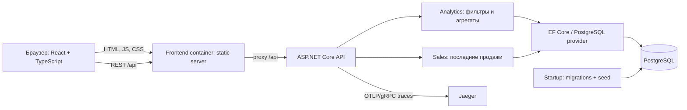
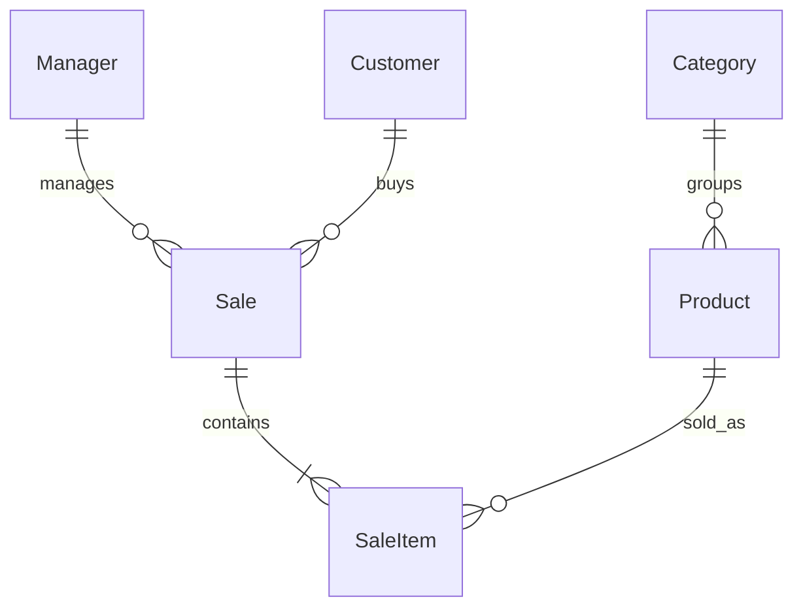

# Архитектура

**Статус: backend и frontend v1 реализованы на .NET 10 и React.** EF Core migrations, PostgreSQL, seed, серверные агрегаты и API работают. DTO и OpenAPI описаны в api-contract.md; тесты на NUnit. Frontend proxy и OpenTelemetry/Jaeger подключены в Compose.

## Контекст и границы

Один desktop dashboard читает аналитику продаж из PostgreSQL. Источник первоначальных данных — автоматический seed. CRUD, внешние интеграции, авторизация и отдельная admin panel не требуются. В пределах 8 часов достаточно одного backend-приложения, одного frontend и одной БД.

Принят один origin через frontend proxy: он отдаёт статические файлы и проксирует `/api`. БД доступна только внутри Compose network. Redis, брокер, CQRS-фреймворк, универсальный Repository и отдельные микросервисы не нужны для данного объёма. При необходимости raw SQL допускается ТЗ, но вводится только с объяснением конкретного запроса.

## Backend

Решение разделено на API-сборку `SalesDashboard.Api` и отдельную сборку `SalesDashboard.DataAccess`. Публичные контракты сервисов API находятся в `Api/Abstractions/Services`, а EF Core DbContext, миграции, seed, доменные сущности и контракт инициализации базы — в `DataAccess`. Endpoints отвечают за HTTP/валидацию, query-сервисы API — за правила выборки и SQL-агрегации, `DataAccess` — за EF mapping/migrations/seed. Контракты отделены от реализаций.

Read-only запросы используют DTO projections, `AsNoTracking`, async I/O и `CancellationToken`. Бизнес-фильтр статусов/дат централизуется. DbContext не используется параллельно в нескольких запросах. Валидация from/to, sort и limit выполняется до обращения к БД. Предлагается единый формат ProblemDetails: 400 — неверные параметры, 500 — непредвиденная ошибка без SQL/stack trace для пользователя; детали остаются в логах.

## Модель данных

| Сущность | Предлагаемые поля помимо Id | Связи / правила |
| --- | --- | --- |
| Manager | Name, Team, Position, IsActive, AvatarUrl nullable, Initials | 1:N Sale |
| Customer | Name, Company, Segment | 1:N Sale |
| Category | Name | 1:N Product |
| Product | Name, CategoryId, Sku | Category обязательна; Sku — предложенный атрибут |
| Sale | ManagerId, CustomerId, SoldAt, Status | Менеджер и клиент обязательны; минимум одна позиция |
| SaleItem | SaleId, ProductId, Quantity, UnitPrice, UnitCost | Снимок цены/себестоимости; Quantity > 0 |

Предлагаемые Id — integer; финансовые поля — `numeric(18,2)` / C# decimal; SoldAt — `timestamptz`; Status — строковое значение с ограничением набора; Quantity — integer. Ограничения цены/себестоимости ≥ 0, FK NOT NULL. Наличие хотя бы одной позиции обеспечивает создание агрегата Sale/seed, простой FK это условие не гарантирует. Запретить удаление использованных справочников; физическое удаление вообще не требуется API. Зафиксировать выбранные типы в миграциях после D-14.

Revenue/GrossProfit не хранить как независимые изменяемые итоги: вычислять из SaleItem. Агрегации должны избегать размножения строк при JOIN и ошибки `COUNT(*)` после соединения Sale с SaleItem. SalesCount считать по продажам или `COUNT(DISTINCT SaleId)`.

## Проект API

Принят общий `GET /api/dashboard` для агрегатов и отдельный `GET /api/sales` для ограниченной истории. Маршруты реализованы; схема — `/openapi/v1.json`, пояснения — [api-contract.md](api-contract.md).

| Маршрут | Параметры | Результат |
| --- | --- | --- |
| `GET /api/dashboard` | `from`, `to` — ISO date; `rankingBy=grossProfit|averageCheck` | Период/timezone, KPI, рейтинг, динамика, категории, top продуктов, при реализации — сравнение |
| `GET /api/sales` | Те же `from`, `to`; `limit` с верхней границей | Items с датой, менеджером, клиентом, позициями, статусом, суммой и прибылью |
| `GET /api/health/ready` | Нет | Готовность после подключения к БД, миграций и seed |

Структура dashboard DTO: `period {from, to, timeZone}`, `kpis {revenue, grossProfit, margin, salesCount, averageCheck, bestManager}`, `ranking[]`, `series[]`, `categories[]`, `topProducts[]`. Каждая строка рейтинга содержит ManagerId и метрики. `null` означает отсутствие определённого значения, пустой массив — отсутствие строк. Для графика приняты ежедневные buckets с нулями на пропущенных датах. Сервер может дополнить ряд календарём после SQL-агрегации, не выгружая все продажи. Приняты top-5 продуктов и limit истории 20 по умолчанию, максимум 100. Деньги передаются десятичными строками, доли — числами; бизнес-зона Europe/Moscow.

Сравнение — SHOULD: при включении возвращать границы предыдущего периода и текущие/предыдущие значения, не оставлять выбор границ клиенту. Новый запрос периода отменяет старый на клиенте; query key содержит from/to/rankingBy. Ответ старого запроса не должен перезаписывать новый период.

## PostgreSQL и индексы

Следующие индексы созданы начальной миграцией; фактические запросы проверяются через EXPLAIN на полном seed:

| Индекс | Назначение / условие |
| --- | --- |
| `Sales(SoldAt DESC, Id DESC)` | Фильтр периода и стабильная сортировка последних продаж |
| `Sales(SoldAt, ManagerId) WHERE Status = 'Paid'` | Кандидат для финансовой аналитики; проверить совпадение predicate и реальную пользу |
| `SaleItems(SaleId)` | Соединение с отобранными продажами |
| `SaleItems(ProductId)`, `Products(CategoryId)` | Связи с продуктами/категориями и ограничения FK |
| `Sales(ManagerId)`, `Sales(CustomerId)` | Доступ по связям; учесть индексы, генерируемые EF, без дублирования |

Не добавлять индекс «на всякий случай» на каждое поле. Проверить сгенерированные миграции/SQL и `EXPLAIN (ANALYZE, BUFFERS)` на seed. Полное чтение небольшой таблицы может быть разумнее индекса. SQL должен считать суммы до материализации; история выбирается ограниченно, позиции — проекцией или фиксированным числом запросов, без запроса на каждую строку.

## Frontend и UX

`app` собирает страницу и провайдеры, `features/dashboard` содержит блоки и управление периодом/рейтингом, `shared/api` — контракт и HTTP, `shared/ui` — общие элементы. Принята основа: Vite, TanStack Query, Recharts; версии закреплены lock-файлами. Redux/Zustand не обязательны для одной страницы.

## Observability

API регистрирует OpenTelemetry tracing с ASP.NET Core, HttpClient и EF Core instrumentation. При наличии `OTEL_EXPORTER_OTLP_ENDPOINT` подключается OTLP exporter; Compose задаёт Jaeger как приёмник и сохраняет W3C `tracecontext,baggage`. UI Jaeger опубликован на `localhost:16686`, OTLP/gRPC — на `localhost:4317`.

Состояния: initial loading, смена периода, ошибка с повторной попыткой, пустой период, пустой отдельный блок. Если сохраняются предыдущие данные на время запроса, они явно помечаются загрузкой; нельзя выдавать их за данные нового периода. Ошибка истории может отображаться в таблице при сохранении доступной аналитики. Достаточны аккуратные hover/transition/skeleton; reduced motion — предлагаемое улучшение, не отдельное требование ТЗ.

## Запуск и заполнение

1. Compose запускает PostgreSQL с persistent volume и healthcheck.
2. Backend дожидается БД, применяет EF migrations.
3. Seed при первом запуске создаётся транзакционно; признак завершения устанавливается после успешного наполнения. Повторный старт не дублирует данные; при сбое транзакция откатывается.
4. Backend отмечается ready только после успешных миграций/seed. Ошибка инициализации должна быть видимой в логах.
5. Frontend отдаёт сборку и проксирует API. Пользователь открывает документированный URL; Jaeger UI доступен отдельно для диагностики.

Принят один экземпляр backend, поэтому отдельный migrator-сервис не требуется. Масштабирование и конкурентная миграция за пределами этого решения. `docker-compose.yml` запускает backend, PostgreSQL, frontend, Jaeger и dotnet-monitor; backend выполняет migrations/seed. Повторный старт проверяется backend e2e.

## Проверяемость и риски

Критические проверки перечислены в [плане проверки](verification-plan.md). Наибольшие риски: неверная семантика статусов/периода, дублирование сумм при JOIN, разнородные данные разных периодов в UI, неидемпотентный seed и попытка уместить необязательные блоки в 8 часов. Решения и компромиссы — [open-decisions.md](decisions/open-decisions.md).

## Сборки backend

- SalesDashboard.Api — HTTP endpoints, обработка ошибок и composition root.
- SalesDashboard.Application — бизнес-правила аналитики и продаж, DTO и интерфейсы сервисов.
- SalesDashboard.DataAccess — EF Core, PostgreSQL, миграции, seed и доменные сущности.

Направление зависимостей: Api -> Application -> DataAccess; обратных ссылок нет.

HTTP-слой реализован контроллерами ASP.NET Core в SalesDashboard.Api/Controllers; Program.cs оставлен composition root.

## Frontend

React + TypeScript собирается Vite. TanStack Query управляет загрузкой и отменой запросов при смене периода и режима рейтинга. Recharts отображает ежедневную выручку и прибыль. Nginx в frontend-контейнере отдаёт статику и проксирует `/api` к backend, создавая единый origin для браузера. Значения KPI, сортировка рейтинга и денежные расчёты поступают из API.
